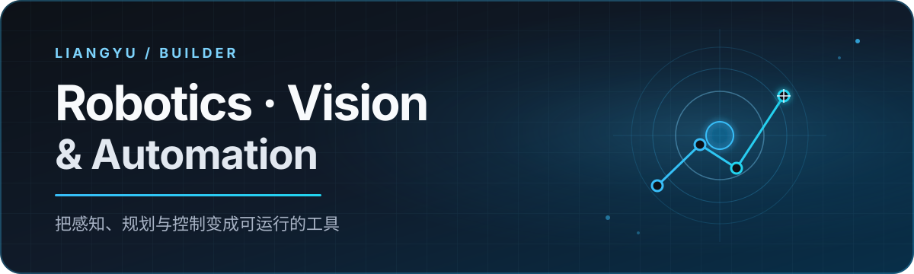

  

  用 C++ 与 Python，把感知、规划和控制变成真正可运行的工具。

  
  

## 你好，我是 LiangYu 👋

我关注机器人应用、计算机视觉和自动化工具，喜欢把算法接入真实的软件流程：从识别画面、规划路径，到驱动设备或桌面程序完成任务。

- 🤖 使用 **ROS 2 / MoveIt 2** 学习机械臂运动规划与控制
- 👁️ 使用 **OpenCV / YOLO** 处理视觉检测、定位与标定
- 🧭 探索状态机、路径规划和游戏 AI 的工程化实现
- 🛠️ 用 **C++ / Python / Qt** 制作解决实际问题的小工具

## 精选项目

<table>
  <tr>
    <td width="50%" valign="top">
      <h3><a href="https://github.com/liangyuR/wot_ai">WoT AI</a></h3>
      
《坦克世界》自动化与导航助手，组合状态机、视觉检测、小地图识别、A* 路径规划和键鼠控制。

      
<code>Python</code> <code>OpenCV</code> <code>YOLO</code> <code>Path Planning</code>

    </td>
    <td width="50%" valign="top">
      <h3><a href="https://github.com/liangyuR/Moveit-lab">MoveIt Lab</a></h3>
      
围绕 ROS 2 与 MoveIt 2 的机械臂运动规划实验和中文学习笔记，从最小示例逐步理解规划与执行流程。

      
<code>C++</code> <code>ROS 2</code> <code>MoveIt 2</code>

    </td>
  </tr>
  <tr>
    <td width="50%" valign="top">
      <h3><a href="https://github.com/liangyuR/HandEyeCalibrate">HandEyeCalibrate</a></h3>
      
面向机器人视觉场景的手眼标定 Demo，用于整理标定流程并验证坐标变换结果。

      
<code>Python</code> <code>Robot Vision</code> <code>Calibration</code>

    </td>
    <td width="50%" valign="top">
      <h3><a href="https://github.com/liangyuR/QtTsXlsxConverter">QtTsXlsxConverter</a></h3>
      
在 Qt TS 翻译文件与 XLSX 表格之间转换，降低多语言内容批量维护的成本。

      
<code>Python</code> <code>Qt Tooling</code> <code>XLSX</code>

    </td>
  </tr>
</table>

## 技术栈

  
  
  
  
  
  

## 代码之外

🎮 游戏 · 🚴 骑行 · 🧳 旅行

如果你也对机器人软件、C++ 桌面开发、自动化或游戏 AI 感兴趣，欢迎在相关项目中交流。
